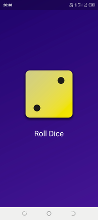

## About

Roll Dice app for Android. Flutter/Dart project. The project was created in Visual Studio Code. 

## Documentation

Project contains:
- Random Roll Dice from 1 to 6.
- Roll Dice on the screen device by pressing the button "Roll Dice".
- Purple-blue gradient design style.

Application:

- Roll Dice =>

 